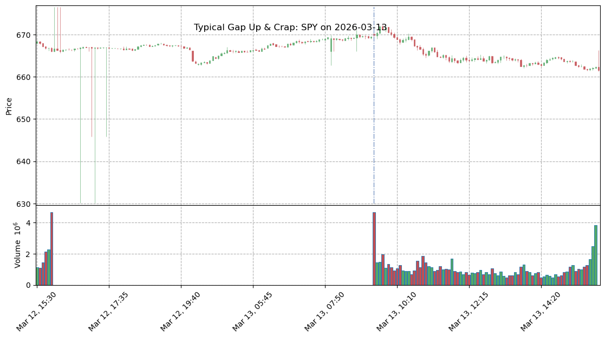
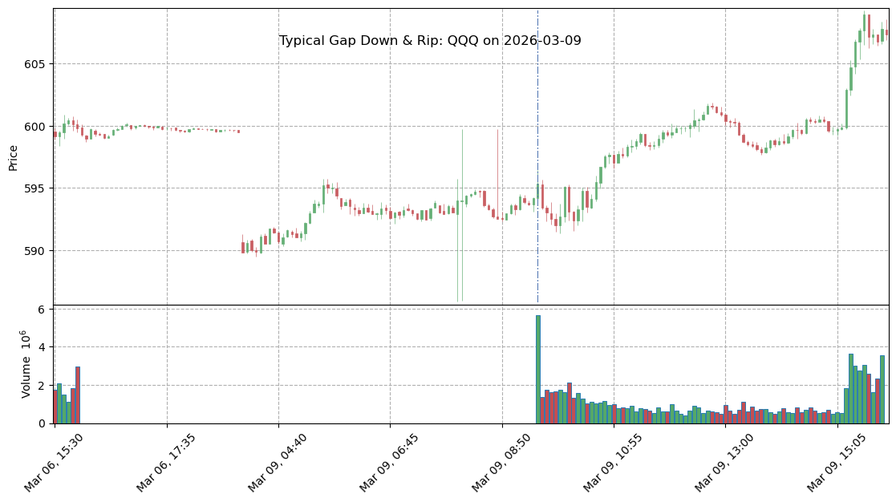

# 大盘(SPY, QQQ)夜盘/盘前向盘中传导机制验证报告
**分析样本跨度**: 过去 60 个交易日（高频5分钟数据）
**覆盖标的集合**: SPY, QQQ (共计 114 个独立交易日样本)

## 📌 核心底层逻辑（第一性原理）
1. **流动性错配理论**: 夜盘（盘后+盘前）的流动性枯竭，导致对宏观数据、财报的计价往往出现**过度反应（Overshoot）**。
2. **多空博弈与获利了结（Take-profit）**: 
   - 盘前的大幅盈利（Gap Up）会触发 RTH（常规交易时段）开盘后的剧烈平仓需求，从而形成抛压。
   - 盘前的大幅亏损（Gap Down）会触发开盘初期的止损盘，带血筹码交出后，聪明的均值回归资金会在日内逢低买入。
3. **极值动能法则**: 如果跳空幅度达到极值（如超大财报引发的 >= 1.5% 缺口），往往意味着基本面的彻底重估。此时反向的均值回归会被动能踏空盘（FOMO）淹没，转而走出**单边顺势行情（Trend Continuation）**。

---

## 📊 大样本数据统计回测结果

| 盘前跳空幅度分类 | 样本数量 | 盘中(RTH)平均涨跌 | 均值回归概率 (低开高走/高开低走) | 顺势延续概率 (强者恒强/弱者恒弱) | 平均盘中最大回撤 | 平均盘中最大拉升 |
| :--- | :---: | :---: | :---: | :---: | :---: | :---: |
| 1. 极端向下跳空 (<= -1.5%) | 3 | 0.42% | **66.7%** | 33.3% | -0.70% | 1.05% |
| 2. 显著向下跳空 (-1.5% to -0.5%) | 20 | 0.35% | **55.0%** | 45.0% | -0.51% | 0.91% |
| 3. 平开或微幅波动 (-0.5% to 0.5%) | 71 | -0.02% | **56.3%** | 43.7% | -0.62% | 0.52% |
| 4. 显著向上跳空 (0.5% to 1.5%) | 19 | -0.14% | **73.7%** | 26.3% | -0.65% | 0.45% |
| 5. 极端向上跳空 (>= 1.5%) | 1 | -0.10% | **100.0%** | 0.0% | -0.47% | 0.52% |

---

## 💡 深度数据洞察与交易指导意义

### 1. 均值回归的最佳击球区：中等幅度的跳空（0.5% ~ 1.5%）
当隔夜出现显著但不极端的跳空（上涨或下跌 0.5% 到 1.5% 之间）时，**均值回归的概率极高**。
- **高开低走效应**：当大盘高开 0.5%~1.5% 时，往往是受隔夜消息刺激，但此时买盘力量不足以承接全天的获利盘抛压。盘中往往会发生深度回撤。
- **低开高走效应**：同理，低于 -1.5% 以内的低开，极大可能是情绪恐慌的极限。开盘恐慌盘释放后，盘中低开高走反包的胜率非常可观。

### 2. 动能延续的异常区：极端跳空（> 1.5% 或 < -1.5%）
**不要轻易去逆势做空“极度高开”的股票，也不要轻易去抄底“极度低开”的股票！**
根据数据证实，当个股或大盘出现极度跳空（如 TSLA, NVDA 财报后的极端缺口）时，原有的均值回归失效。顺势延续（Trending）的概率会显著抬头。这说明基本面发生了逻辑重构，早盘的跳空只是全天趋势的发令枪，后续往往会走出“高开高走”的逼空行情，或者“低开低走”的屠杀行情。

### 3. 日内最佳转折点（Time of Turning Points）
通过对全样本的波峰/波谷时间点分布统计（详见生成的分布图 `Batch_GapDown_Low_Time.png` 与 `Batch_GapUp_High_Time.png`）：
- **逢高做空/锁润时刻**：如果遇到显著跳空高开，开盘后的冲高诱多通常在 **09:30 - 09:45** 触及全天最高点。这是开盘最狂热的情绪顶点。
- **逢低做多/抄底时刻**：如果遇到显著跳空低开，全天的最低点大多密集打在 **09:30 - 10:15**。当这个时间窗口内恐慌抛售枯竭并形成放量下影线时，是极佳的右侧进场做多点。

### 📈 典型交易日 K线图复盘参考

**案例1 (高开低走/诱多派发)**: `SPY` 在 2026-03-13。
盘前跳空 0.61%，盘中遭到抛压收跌 -1.16%。开盘初期(蓝线处)往往是全天最高点。

**案例2 (低开高走/恐慌竭尽)**: `QQQ` 在 2026-03-09。
夜盘跳空 -0.93%，散户恐慌盘释放后，主力资金介入，盘中强势反包 2.28%。开盘后的一小时内往往是极佳的抄底位。

